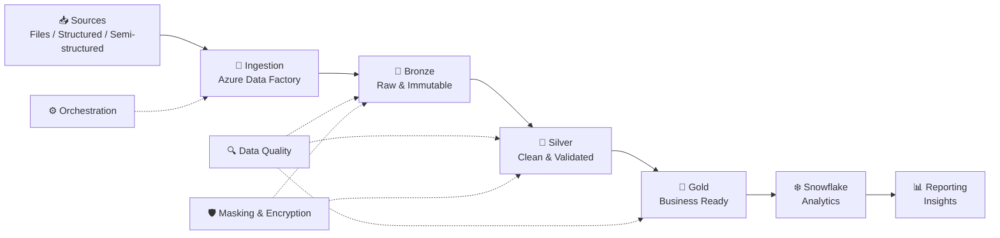

<div align="center">


<a href="https://github.com/Abhinav-K-Singh">

</a>
<a href="mailto:singhabhinav.aks@gmail.com">

</a>

<br><br>


</div>

---

## 🧭 `whoami`

> **Cloud Data Engineer** focused on production ETL/ELT, distributed processing, cloud data platforms and automation.

<table>
<tr>
<td width="55%">

### ⚡ At a glance

- 🏢 **Cloud Data Engineer** at Tata Consultancy Services
- ☁️ **Azure-first** data engineering
- 🔥 **Databricks + PySpark** for distributed processing
- ❄️ **Snowflake** for analytics workloads
- 🐍 **Python + SQL** for transformation & pipeline development
- 🔄 **ADF + Control-M + Databricks Workflows**
- 🛡️ Data quality, masking, encryption & monitoring
- 🚀 Exploring **Agentic AI data readiness**

</td>
<td width="45%">

### 🎯 Engineering scoreboard

| Metric | Impact |
|---|---:|
| 📦 Records processed | **10M+** |
| 📁 Files automated | **1,000+** |
| ⚡ Query / processing improvement | **35%** |
| 🤖 Manual effort reduced | **30%** |
| 🏆 Applause Awards | **2×** |
| ⭐ Spot Awards | **2×** |

</td>
</tr>
</table>

---

## 🧰 My Data Engineering Stack

<div align="center">

### ☁️ Cloud & Platform


### ⚙️ Code & Processing


### 🔄 Engineering & Orchestration


</div>

---

## 🏗️ How I Think About Data



<details>
<summary>🔎 Click to see the architecture philosophy</summary>

<br>

**Bronze → Silver → Gold** keeps ingestion, transformation and business-ready data separated.

- **Bronze:** preserve incoming data and ingestion history
- **Silver:** clean, validate and transform
- **Gold:** serve analytics and reporting use cases
- **Orchestration:** automate dependencies and schedules
- **Quality:** validate data throughout the pipeline
- **Security:** protect sensitive production data

</details>

---

## 🚀 Featured Engineering Projects

<table>
<tr>
<td width="50%">

### 🏥 Walgreens Healthcare Data Platform

**Stack:** `Azure Databricks` `PySpark` `Spark SQL` `Snowflake`

Scalable ETL pipelines for structured and semi-structured healthcare data, supporting analytics across millions of records.

**Focus**
- Data ingestion
- Distributed transformation
- Snowflake analytics
- Query optimization
- Data availability

</td>
<td width="50%">

### 🛒 E-Commerce Store Data Pipeline

**Stack:** `Databricks` `Azure Data Factory`

A production-style data pipeline built around the **Medallion Architecture**.

**Focus**
- Bronze → Silver → Gold
- Automated processing
- Reporting workflows
- Data quality
- Analytical performance

</td>
</tr>
</table>

> 💡 **Want the code?** Explore the pinned repositories below. The profile is designed so the projects become the main entry points into the portfolio.

---

## 📈 GitHub Command Center

<div align="center">


<br><br>


</div>

---

## 🐍 Contribution Trail

<div align="center">

<!-- To activate the snake animation, enable the GitHub Action described below. -->


</div>

<details>
<summary>⚙️ How to activate the contribution snake</summary>

Create this file in your profile repository:

`.github/workflows/snake.yml`

```yaml
name: Generate contribution snake

on:
  schedule:
    - cron: "0 0 * * *"
  workflow_dispatch:

jobs:
  generate:
    runs-on: ubuntu-latest
    permissions:
      contents: write

    steps:
      - uses: Platane/snk@v3
        with:
          github_user_name: ${{ github.repository_owner }}
          outputs: |
            dist/github-contribution-grid-snake.svg
            dist/github-contribution-grid-snake-dark.svg?palette=github-dark

      - uses: crazy-max/ghaction-github-pages@v4
        with:
          build_dir: dist
        env:
          GH_PAT: ${{ secrets.GITHUB_TOKEN }}
```

</details>

---

## 🏆 Credentials & Recognition

<div align="center">


<br><br>


</div>

---

## 🧠 Currently Exploring

<table>
<tr>
<td align="center">🤖<br/><b>Agentic AI</b><br/><sub>AI-ready data foundations</sub></td>
<td align="center">💰<br/><b>Finance Automation</b><br/><sub>Data-driven workflows</sub></td>
<td align="center">⚡<br/><b>Spark Optimization</b><br/><sub>Faster distributed workloads</sub></td>
<td align="center">☁️<br/><b>Cloud Data Platforms</b><br/><sub>Scalable architecture</sub></td>
</tr>
</table>

---

## 🗺️ Engineering Roadmap

```text
                    ┌───────────────────────────┐
                    │   CLOUD DATA ENGINEER     │
                    └─────────────┬─────────────┘
                                  │
            ┌─────────────────────┼─────────────────────┐
            ▼                     ▼                     ▼
      ☁️ Cloud Data         ⚡ Distributed         🤖 Intelligent
        Platforms             Processing              Data
            │                     │                     │
       Azure / ADF         Spark / PySpark       Agentic AI
       ADLS / Snowflake    Optimization          Data Readiness
            │                     │                     │
            └─────────────────────┼─────────────────────┘
                                  ▼
                         🚀 Production Systems
```

---

## 🎓 Background

**Tata Consultancy Services** · Cloud Data Engineer  
`June 2024 → Present`

**Chandigarh University** · Bachelor of Engineering, Computer Science  
`2020 → 2024` · **CGPA 7.98**

---

## 📫 Connect With Me

<div align="center">

<a href="mailto:singhabhinav.aks@gmail.com">

</a>
<a href="https://github.com/Abhinav-K-Singh">

</a>

<!-- Replace the URL below with your actual LinkedIn profile -->
<a href="https://www.linkedin.com/in/abhinav712/">

</a>

<br><br>


<br><br>

### `data → pipelines → platforms → impact`

</div>

---

<div align="center">


</div>
